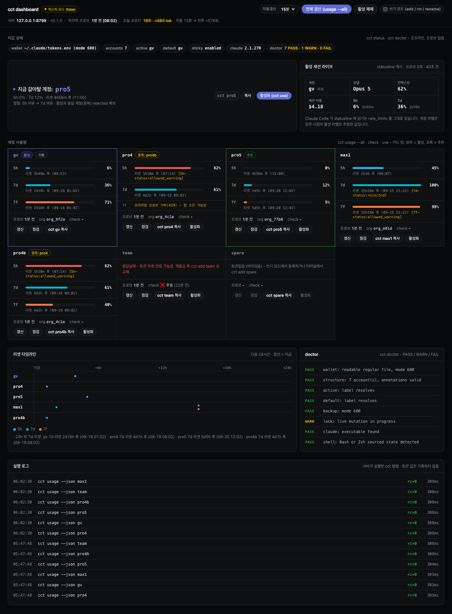
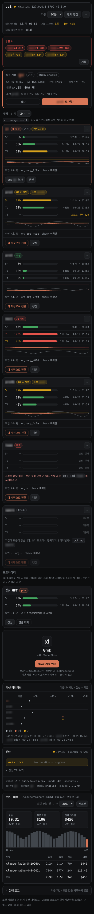
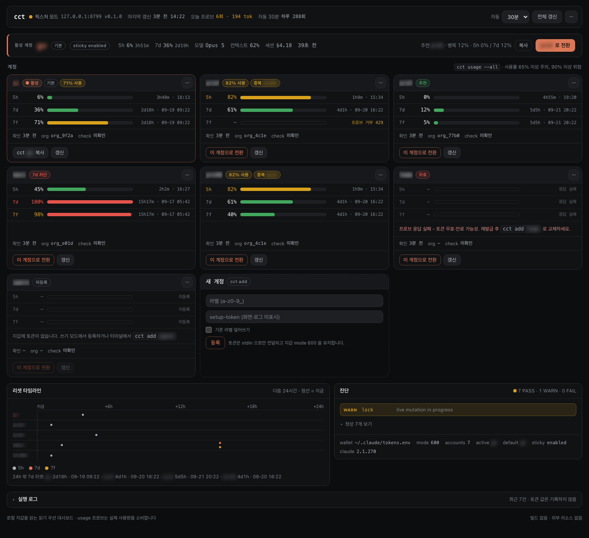

# cct - Portable Claude Account Wallet

[한국어](README.md) · **English**

[](#dashboard-optional)

<sub>The optional [local dashboard](#dashboard-optional) - a fixture-mode demo with account labels blurred. cct itself is a shell tool.</sub>

Authenticate each Claude account once with `claude setup-token`, register the long-lived token in a local wallet, and explicitly select an account with `cct <label>` whenever you need it. Move the wallet securely to use Claude Code in a new environment without repeating browser OAuth login for every account.

**Works on macOS, Linux, and WSL2.** It is not a proxy, orchestrator, automatic router, or load balancer. The user always chooses which account to use.

## Install

Cloning and reviewing the script before installation is recommended.

```sh
git clone https://github.com/Bkankim/cct.git
cd cct
bash install.sh
exec "$SHELL"
```

A one-line install is also available. Because `curl | bash` executes remote code immediately, review it first.

```sh
curl -fsSL https://raw.githubusercontent.com/Bkankim/cct/main/install.sh | bash
```

The installer places `cct.sh` at `~/.claude/cct.sh` and adds a `source` line to the Bash or Zsh startup file. It creates a mode-`600` wallet template only when one is missing. Reinstalling does not overwrite an existing `tokens.env`, backup, active label, or in-progress lock/temp file. Git ignore rules are appended without replacing the user's existing configuration.

## Quick start

Authenticate each account once in a trusted environment and register its setup-token.

```sh
claude auth login --claudeai  # confirm the account shown in the browser
claude setup-token            # copy the issued value
cct add work                  # paste it into the hidden prompt

cct work                      # explicitly select and launch the work account
cct personal                  # switch to the personal account
```

A `setup-token` is the current mechanism for long-lived use, but its lifetime and permanence are not guaranteed. Observed lifetime and provider policy can change. If a token expires, is revoked, or policy changes, issue a new token for that account and replace it with `cct add <label>`.

## Commands

| Command | Behavior |
|---|---|
| `cct [claude args...]` | Launch the sticky active label, or `CCT_DEFAULT_LABEL` (default `gv`) when none is active |
| `cct <label> [claude args...]` | Launch that account and forward all Claude arguments |
| `cct run <label> [claude args...]` | Launch even a reserved label such as `rm` |
| `cct use <label>` | Switch the active label without launching claude |
| `cct active` | Show the current active label |
| `cct refresh` | Apply an active-label switch made in another terminal to this shell |
| `cct off` | Clear active state and cct auth variables from this shell |
| `cct ls` / `cct list` | List registered accounts (no token values) |
| `cct add <label>` | Register or replace a setup-token (hidden input) |
| `cct rm <label> [--force]` | Remove an account after a `[y/N]` prompt |
| `cct rename <old> <new>` | Rename a label without touching the token |
| `cct status` | Wallet path/mode/count, active/default label, Claude version (offline) |
| `cct doctor` | Diagnose wallet, permissions, backup, lock, and shell as `PASS/WARN/FAIL` (offline) |
| `cct check [label]` | Validate token(s) with a real call |
| `cct fp [label]` / `cct who [label]` | Detect duplicate accounts from real-call fingerprints |
| `cct usage [--json] [label\|--all]` | Subscription 5h/7d/7f utilization and reset time (probe ≤32 tokens). `--json` prints one JSON line per label (NDJSON) |
| `cct help` | Built-in help |

Labels use lowercase ASCII letters, digits, and underscores only: `[a-z0-9_][a-z0-9_]*`.

**Exit codes** are `0` success, `1` runtime failure (missing account or token, cancellation, storage failure, invalid token), and `2` usage or label-format error. Launch commands (`cct`, `cct <label>`, `cct run`) return claude's own exit code. Three exceptions: `cct doctor` returns `1` on any FAIL; `cct check` returns `2` when the token is missing, and all-label mode returns `1` if any label fails; `cct fp`, `cct who`, and `cct usage` report a missing token or failed probe in their output only and return `0`.

### Defaults and environment variables

`cct <label>` turns the following on by default; each can be changed with an environment variable.

| Variable | Default | Effect |
|---|---|---|
| `CCT_STICKY` | `1` | Remember the selected account in the current shell and the active file (mode `600`), so plain `claude` and new terminals keep using it. `0` skips persisting |
| `CCT_ACTIVE_FILE` | `cct-active` next to `tokens.env` | Active-label file path |
| `CCT_DEFAULT_LABEL` | `gv` | Label used when nothing is active |
| `CCT_SKIP_PERMS` | `1` | Launch claude with `--dangerously-skip-permissions` |
| `CCT_CLAUDE_FLAGS` | none | Extra claude flags (space-separated) |
| `CCT_DISABLE_WEB_FEATURES` | `1` | Block nonessential web calls (Advisor, telemetry, error reporting); auto-update keeps working |
| `CCT_FIX_ONBOARDING` | `1` | Fix `hasCompletedOnboarding` in the Claude config so an env-token launch skips the login wizard. Missing, symlinked, or malformed configs are left alone and the file mode is preserved |
| `CCT_GJC_WARN` | `1` | Warn (never delete) when gjc's stored anthropic credentials would override the env token |

- An already-open terminal does not follow a switch made elsewhere; run `cct refresh` in that shell.
- When applying or clearing an account, cct exports and unsets `ANTHROPIC_OAUTH_TOKEN` alongside `CLAUDE_CODE_OAUTH_TOKEN`, so env-inheriting tools (gjc, aside, ...) follow the active account.
- The web-blocking flags (`DISABLE_TELEMETRY` and friends) are generic names. If you set them yourself, `cct off`, `cct rm` of the active account, `cct refresh` with no active label, and the opt-out clear them in that shell, and `cct <label>` overwrites them with `1`. To turn auto-update off, set `DISABLE_AUTOUPDATER=1` yourself; cct never reads or writes it.
- For tools that take command-valued secrets instead of inheriting env, the installer ships `~/.claude/cct-token.sh` (mode `700`). It prints the active account's setup-token to stdout only, and exits non-zero with no output when there is no active account or token. Example: aside's `models.json` with `"apiKey": "!<home>/.claude/cct-token.sh"` follows the active account at call time.

## Dashboard (optional)

`dashboard/` holds a local web dashboard that shows wallet state on one screen: per-account 5h/7d/7f utilization and reset times, a switch suggestion, `cct doctor` diagnostics, local token and cost totals, and GPT/Grok subscription usage. It is vanilla HTML/CSS/JS plus a standard-library Python server, with no build step and no external resources.

```sh
uv run --script dashboard/server.py --port 8790          # real wallet
uv run --script dashboard/server.py --fake --port 8799   # fixture mode (zero real probes)
```

Clicking an account card opens its detail view: per-5h-window utilization, limit-hit times, per-session and per-request tokens with API-equivalent cost, model and project breakdowns, and an external-usage estimate. Accounts are told apart by `~/.claude/cct-session-hook.sh`, which the installer registers under SessionStart in `~/.claude/settings.json`. For every session launched through `cct` it appends `{time, session id, label}` to `~/.claude/cct-sessions.jsonl` (mode `600`); it never writes tokens or conversation content. To skip registration, run `CCT_NO_SESSION_HOOK=1 bash install.sh`. Entering an account's monthly subscription price on the detail page shows this month's API-equivalent cost as a multiple of it. Accounts with a running session are probed every 5 minutes, independent of the global auto-refresh (toggle in the settings menu); each probe consumes a little quota. Only sessions launched with `cct` on this machine are attributed; web, app, and other-machine usage shows up only as utilization.

It binds to `127.0.0.1` and is read-first by default, and token values never appear on screen, in responses, or in logs. Usage reads are real API calls that consume a little quota. Screen layout, probe cost, always-on setup, and the GPT/Grok integration and caveats are in [dashboard/README.md](dashboard/README.md).

<details>
<summary>400px mobile and write mode</summary>





</details>

Every screenshot is a fixture-mode (`--fake`) demo with account labels blurred.

## Portability and the OSS boundary

Real credentials live only outside the repository in `~/.claude/tokens.env` (or `CCT_ENV_FILE`). The public repository contains no real wallet, and cloning it grants access to no account. `.gitignore` and the installer's global ignore entries reduce accidents; they are not a security boundary, and users remain responsible for never adding credential files to Git.

Move the wallet through an encrypted channel such as a password manager's secure file transfer.

```sh
mkdir -p ~/.claude
# restore tokens.env from the password manager to ~/.claude/tokens.env
chmod 600 ~/.claude/tokens.env
cct doctor
```

Do not use plaintext cloud sync, chat, email, or a Git commit to move the wallet. Its line format is `CCT_TOKEN_<LABEL>=<SETUP_TOKEN>`; `<SETUP_TOKEN>` is an obvious placeholder, not a credential.

## Storage, backup, and locking

`add`, `rm`, and `rename` write a mode-`600` temporary file in the same directory and finish with an atomic `mv`. Before changing an existing wallet, cct creates a mode-`600` rolling backup at `tokens.env.bak`. Only one rolling backup is retained; keep any longer-term copy in separate encrypted storage.

Concurrent mutations are serialized by a `tokens.env.lock/` directory. If the PID in valid owner metadata is alive, the lock is always busy regardless of the recorded epoch's age. The next mutation can reclaim a lock only when the owner metadata is valid, its PID is dead, and the observed owner still matches during removal. The epoch is diagnostic timing data, not a timeout or reclamation condition. `cct doctor` only reports the condition; it never recovers or modifies files.

If the wallet is damaged, first make sure no cct mutation is still running, then restore the backup.

```sh
cp ~/.claude/tokens.env.bak ~/.claude/tokens.env
chmod 600 ~/.claude/tokens.env
cct doctor
```

Removing or renaming the active account treats wallet and active-state changes as a recoverable transaction. If the active-state write fails, cct restores the verified wallet backup.

## Threat model and operational security

- Treat a setup-token with the same sensitivity as an account password. Revoke or reissue an exposed token for that account, then replace it with `cct add <label>`.
- Portability uses a plaintext wallet. Mode `600` limits ordinary access by other local users, but it does not stop administrators, malware, a compromised user account, or disk theft. Pair it with at-rest encryption such as macOS FileVault, Linux full-disk encryption, or Windows BitLocker.
- `tokens.env.bak` is as sensitive as the primary wallet. Protect it in backups, snapshots, and diagnostic bundles.
- On WSL2, keep the wallet under the Linux home directory at `~/.claude`. Avoid `/mnt/c`, where Linux `chmod 600` semantics may be weakened.
- Do not expose tokens on shared computers, public CI, shell traces (`set -x`), process arguments, or logs. `status` and `doctor` neither print tokens nor validate them over the network.
- Expiry and server-side revocation are normal operational events. cct does not store OAuth refresh state or reauthenticate automatically, so issue a new setup-token for the affected account.

## Intentional non-goals

cct is not an OAuth refresh service, proxy, orchestrator, automatic or quota-based router, load balancer, GUI, or daemon. It does not inspect account state to choose the “best” account and never replaces the user's explicit choice. It also requires neither macOS Keychain nor a separate runtime.

## License

MIT - [LICENSE](LICENSE)
